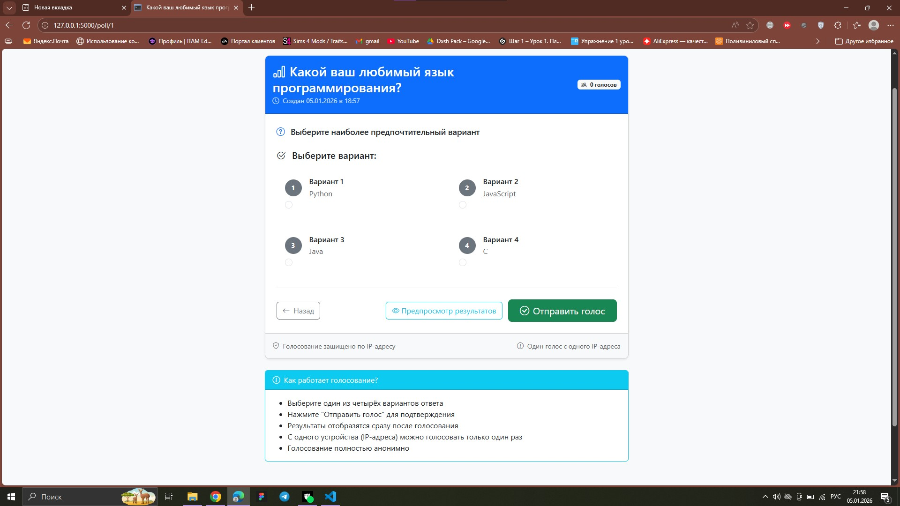
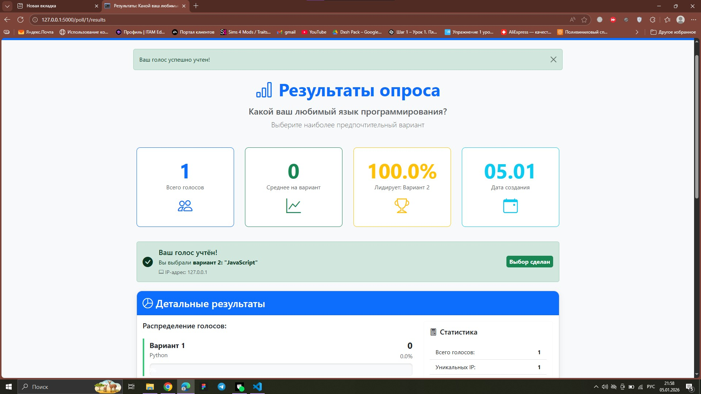
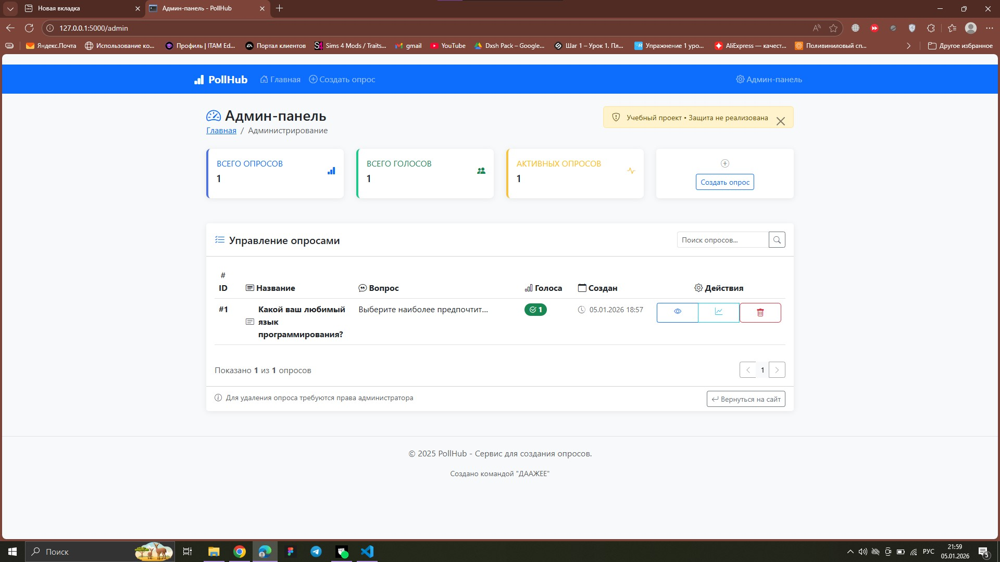

# PollHub - Сервис для создания опросов


**PollHub** — простое и удобное веб-приложение для создания опросов и голосования. Позволяет быстро создавать опросы с четырьмя вариантами ответов, делиться ими и просматривать результаты в реальном времени.

##  Возможности

-  **Создание опросов** — интуитивная форма с 4 вариантами ответов
-  **Анонимное голосование** — защита от накрутки по IP-адресу
-  **Результаты в реальном времени** — диаграммы и проценты
-  **Админ-панель** — управление опросами и статистика

##  Быстрый старт

### Предварительные требования
- Python 3.10 или выше
- Git

### Установка

1. **Клонируйте репозиторий**
   ```bash
   git clone https://github.com/Gukasio/pollhub-app.git
   cd pollhub-app
   ```

2. **Создайте виртуальное окружение**
   ```bash
   python -m venv venv
   
   # Активация на Windows:
   venv\Scripts\activate
   
   # Активация на Mac/Linux:
   source venv/bin/activate
   ```

3. **Установите зависимости**
   ```bash
   pip install -r requirements.txt
   ```

4. **Запустите приложение**
   ```bash
   python app.py
   ```

5. **Откройте в браузере**
   ```
   http://localhost:5000
   ```

##  Технологический стек

### Backend
- **Python 3.10** — основной язык программирования
- **Flask 2.3.3** — веб-фреймворк
- **Flask-SQLAlchemy** — ORM для работы с базой данных
- **SQLite** — легковесная база данных

### Frontend
- **HTML5/CSS3** — разметка и стили
- **Bootstrap 5.3** — адаптивная верстка
- **JavaScript** — интерактивность
- **Jinja2** — шаблонизация

### Инструменты
- **Git & GitHub** — контроль версий
- **GitHub Actions** — CI/CD пайплайн
- **Trello** — управление задачами
- **Pytest** — модульное тестирование

##  Структура проекта

```
pollhub-app/
├── app.py              # Основной файл приложения Flask
├── requirements.txt    # Зависимости Python
├── test_app.py        # Модульные тесты
├── .github/workflows/ # CI/CD конфигурация
│   └── python-app.yml
├── templates/         # HTML шаблоны
│   ├── base.html     # Базовый шаблон
│   ├── index.html    # Главная страница
│   ├── create_poll.html # Форма создания
│   ├── poll_detail.html # Страница опроса
│   ├── poll_results.html # Результаты
│   ├── admin.html    # Админ-панель
│   ├── 404.html      # Страница 404
│   └── 500.html      # Страница 500
└── static/           # Статические файлы
    ├── css/
    │   └── style.css # Кастомные стили
    └── js/
        └── script.js # JavaScript логика
```

##  Команда разработчиков

| Роль | Имя | Группа | Ответственность |
|------|-----|--------|-----------------|
| **Backend-разработчик** | Конюхова Нина | БИВТ-24-3 | Логика приложения, API, база данных, тестирование |
| **Frontend-разработчик** | Гукасян Валерий | БИВТ-24-3 | HTML/CSS, Bootstrap, интерфейс, UX/UI |

##  Процесс разработки

### Управление проектом
- **Методология**: Kanban
- **Доска задач**: [Trello](https://trello.com/invite/b/692b51043579ac7159497927/ATTI76e25e5a564a49a4ba47c29ff54ce79fE203EEC9/pollhub-сервис-опросов)
- **Версионность**: Git Flow

### Рабочий процесс
1. **Планирование** — разбивка задач в Trello
2. **Разработка** — работа в feature-ветках
3. **Code Review** — проверка через Pull Requests
4. **Тестирование** — автоматические и ручные тесты
5. **Деплой** — мердж в main ветку

### Качество кода
-  Автоматическая проверка через GitHub Actions
-  Модульное тестирование с Pytest
-  Code Review между разработчиками
-  Линтинг кода с flake8

## 📈 Основные маршруты

| Маршрут | Метод | Описание |
|---------|-------|----------|
| `/` | GET | Главная страница со списком опросов |
| `/create` | GET/POST | Создание нового опроса |
| `/poll/<id>` | GET | Страница опроса с формой голосования |
| `/poll/<id>/vote` | POST | Обработка голосования |
| `/poll/<id>/results` | GET | Результаты опроса |
| `/admin` | GET | Админ-панель |
| `/admin/poll/<id>/delete` | POST | Удаление опроса |

##  Тестирование

### Запуск тестов
```bash
# Все тесты
pytest test_app.py -v

# Конкретный тест
pytest test_app.py::test_create_poll -v
```

### Покрытие тестами
- Главная страница и навигация
- Создание и отображение опросов
- Процесс голосования
- Страница результатов
- Модели базы данных
- Админ-панель

##  CI/CD

Проект использует GitHub Actions для автоматической проверки кода:
- **При каждом коммите** — запуск тестов и линтинга
- **При Pull Request** — проверка перед мерджем
- **Автоматически** — установка зависимостей и проверка сборки

##  История разработки

- **08.11.2025** — Начало проекта
- **Этап 1** — Настройка окружения, базовый Flask, модели БД
- **Этап 2** — Главная страница, создание опросов, голосование
- **Этап 3** — Результаты, админ-панель, тестирование
- **05.01.2026** — Завершение разработки, рефакторинг, документация

## Скриншоты

### Главная страница


*Список всех опросов, отсортированных по дате создания*

### Создание нового опроса


*Интуитивная форма с 4 вариантами ответов*

### Голосование
a

### Результаты голосования


*Визуализация результатов с прогресс-барами*

### Админ-панель



*Управление опросами и просмотр статистики*

### Дополнительная демонстрация функционала

